# Dalgo Lite - Database Schema

> **Last Updated:** 2026-02-01
> **Database:** PostgreSQL (Supabase)
> **ORM:** SQLAlchemy 2.0

---

## Entity Relationship Diagram

```mermaid
erDiagram
    %% ==================
    %% CORE ENTITIES
    %% ==================

    users {
        uuid id PK
        string email UK
        string password_hash
        string full_name
        boolean is_active
        boolean is_superadmin
        timestamp created_at
        timestamp updated_at
        timestamp deleted_at
    }

    organizations {
        uuid id PK
        string name
        string slug UK
        text description
        enum org_type
        jsonb settings
        timestamp created_at
        timestamp updated_at
        timestamp deleted_at
    }

    organization_members {
        uuid id PK
        uuid user_id FK
        uuid organization_id FK
        enum role
        timestamp created_at
        timestamp updated_at
        timestamp deleted_at
    }

    %% ==================
    %% AUTHENTICATION
    %% ==================

    invitations {
        uuid id PK
        string email
        uuid organization_id FK
        enum role
        string token UK
        timestamp expires_at
        timestamp accepted_at
        uuid invited_by_id FK
        timestamp created_at
        timestamp updated_at
    }

    refresh_tokens {
        uuid id PK
        uuid user_id FK
        string token_hash UK
        timestamp expires_at
        timestamp revoked_at
        timestamp created_at
        timestamp updated_at
    }

    password_reset_tokens {
        uuid id PK
        uuid user_id FK
        string token_hash UK
        timestamp expires_at
        timestamp used_at
        timestamp created_at
        timestamp updated_at
    }

    %% ==================
    %% SOURCE MANAGEMENT
    %% ==================

    sources {
        uuid id PK
        uuid organization_id FK
        string name
        text description
        enum source_type
        jsonb config
        string warehouse_table_name
        timestamp last_synced_at
        uuid created_by_id FK
        timestamp created_at
        timestamp updated_at
        timestamp deleted_at
    }

    source_schemas {
        uuid id PK
        uuid source_id FK
        string column_name
        string column_type
        int column_order
        boolean is_nullable
        jsonb metadata
        timestamp created_at
        timestamp updated_at
        timestamp deleted_at
    }

    sync_runs {
        uuid id PK
        uuid source_id FK
        enum status
        timestamp started_at
        timestamp completed_at
        int rows_synced
        text error_message
        jsonb details
        uuid triggered_by_id FK
        timestamp created_at
        timestamp updated_at
        timestamp deleted_at
    }

    %% ==================
    %% WAREHOUSE
    %% ==================

    warehouse_connections {
        uuid id PK
        uuid organization_id FK,UK
        string database_name
        text access_token_encrypted
        boolean is_connected
        timestamp last_connected_at
        jsonb config
        timestamp created_at
        timestamp updated_at
        timestamp deleted_at
    }

    warehouse_tables {
        uuid id PK
        uuid warehouse_connection_id FK
        string table_name
        uuid source_id FK
        uuid transformation_id FK
        bigint row_count
        bigint size_bytes
        timestamp last_updated_at
        jsonb schema_info
        timestamp created_at
        timestamp updated_at
        timestamp deleted_at
    }

    %% ==================
    %% TRANSFORMATIONS
    %% ==================

    transformations {
        uuid id PK
        uuid organization_id FK
        string name
        text description
        jsonb recipe
        string output_table_name
        int current_version
        timestamp last_run_at
        uuid created_by_id FK
        timestamp created_at
        timestamp updated_at
        timestamp deleted_at
    }

    transformation_versions {
        uuid id PK
        uuid transformation_id FK
        int version_number
        jsonb recipe
        text generated_sql
        uuid created_by_id FK
        text change_description
        timestamp created_at
        timestamp updated_at
        timestamp deleted_at
    }

    transformation_runs {
        uuid id PK
        uuid transformation_id FK
        int version_number
        enum status
        timestamp started_at
        timestamp completed_at
        text executed_sql
        int rows_affected
        text error_message
        jsonb details
        uuid triggered_by_id FK
        timestamp created_at
        timestamp updated_at
        timestamp deleted_at
    }

    %% ==================
    %% OUTPUT & SCHEDULING
    %% ==================

    outputs {
        uuid id PK
        uuid organization_id FK
        uuid transformation_id FK
        string name
        text description
        jsonb destination_config
        timestamp last_refreshed_at
        uuid created_by_id FK
        timestamp created_at
        timestamp updated_at
        timestamp deleted_at
    }

    schedules {
        uuid id PK
        uuid organization_id FK
        uuid source_id FK
        uuid output_id FK
        enum frequency
        time run_at_time
        int run_at_day
        string timezone
        boolean is_active
        timestamp last_run_at
        timestamp next_run_at
        uuid created_by_id FK
        timestamp created_at
        timestamp updated_at
        timestamp deleted_at
    }

    %% ==================
    %% AUDIT
    %% ==================

    audit_logs {
        uuid id PK
        uuid organization_id FK
        uuid user_id FK
        string action
        string resource_type
        uuid resource_id
        jsonb details
        string ip_address
        text user_agent
        timestamp created_at
        timestamp updated_at
    }

    %% ==================
    %% RELATIONSHIPS
    %% ==================

    users ||--o{ organization_members : "has"
    organizations ||--o{ organization_members : "has"

    users ||--o{ refresh_tokens : "has"
    users ||--o{ password_reset_tokens : "has"
    users ||--o{ invitations : "creates"
    organizations ||--o{ invitations : "has"

    organizations ||--o{ sources : "owns"
    users ||--o{ sources : "creates"
    sources ||--o{ source_schemas : "has"
    sources ||--o{ sync_runs : "has"
    users ||--o{ sync_runs : "triggers"

    organizations ||--|| warehouse_connections : "has"
    warehouse_connections ||--o{ warehouse_tables : "contains"
    sources ||--o{ warehouse_tables : "creates"
    transformations ||--o{ warehouse_tables : "creates"

    organizations ||--o{ transformations : "owns"
    users ||--o{ transformations : "creates"
    transformations ||--o{ transformation_versions : "has"
    users ||--o{ transformation_versions : "creates"
    transformations ||--o{ transformation_runs : "has"
    users ||--o{ transformation_runs : "triggers"

    organizations ||--o{ outputs : "owns"
    transformations ||--o{ outputs : "produces"
    users ||--o{ outputs : "creates"
    outputs ||--o| schedules : "has"
    sources ||--o| schedules : "has"
    organizations ||--o{ schedules : "owns"

    organizations ||--o{ audit_logs : "has"
    users ||--o{ audit_logs : "creates"
```



---

## Table Descriptions

### Core Entities

| Table | Purpose |
|-------|---------|
| `users` | User accounts with email/password authentication |
| `organizations` | Multi-tenant root entity (each NGO = one org) |
| `organization_members` | User membership in orgs with role-based access |

### Authentication

| Table | Purpose |
|-------|---------|
| `invitations` | Pending invitations to join an organization |
| `refresh_tokens` | JWT refresh tokens for session management |
| `password_reset_tokens` | Tokens for password reset flow |

### Source Management

| Table | Purpose |
|-------|---------|
| `sources` | Data source configurations (Google Sheets, etc.) |
| `source_schemas` | Inferred column schemas for each source |
| `sync_runs` | History of data sync operations |

### Warehouse

| Table | Purpose |
|-------|---------|
| `warehouse_connections` | MotherDuck connection config per org |
| `warehouse_tables` | Registry of tables in user's warehouse |

### Transformations

| Table | Purpose |
|-------|---------|
| `transformations` | Transformation definitions (recipes) |
| `transformation_versions` | Version history for transformations |
| `transformation_runs` | Execution history |

### Output & Scheduling

| Table | Purpose |
|-------|---------|
| `outputs` | Materialized outputs from transformations |
| `schedules` | Scheduled sync/transform operations |

### Audit

| Table | Purpose |
|-------|---------|
| `audit_logs` | Action audit trail for compliance |

---

## Enums

### OrgType
```
team      - Full organization (NGO)
personal  - Personal workspace (future)
```

### OrgMemberRole
```
owner   - Full access, can delete org
admin   - Manage sources, transforms, invite members
member  - Create/edit transforms
viewer  - Read-only access
```

### SourceType
```
google_sheets - Google Sheets (primary)
csv           - CSV files (future)
postgres      - PostgreSQL (future)
api           - REST API (future)
```

### SyncStatus / TransformationStatus
```
pending  - Queued for execution
running  - Currently executing
success  - Completed successfully
failed   - Completed with error
```

### ScheduleFrequency
```
hourly  - Run every hour
daily   - Run once per day
weekly  - Run once per week
monthly - Run once per month
```

---

## Indexes

All tables have indexes on:
- Primary key (`id`)
- Foreign keys used in JOINs
- `organization_id` (for multi-tenant queries)
- Unique constraints where applicable

Additional indexes:
- `users.email` - Login lookup
- `invitations.token` - Invitation validation
- `refresh_tokens.token_hash` - Token validation
- `audit_logs.action` - Audit filtering

---

## Design Principles

1. **UUIDs for all PKs** - Distributed-friendly, no sequential ID exposure
2. **Soft deletes** - `deleted_at` timestamp on most tables
3. **Audit columns** - `created_at`, `updated_at` on all tables
4. **JSONB for flexibility** - `config`, `settings`, `details`, `metadata` columns
5. **Proper cascading** - `ON DELETE CASCADE` for child records
6. **Row-level security ready** - All queries can be scoped by `organization_id`
